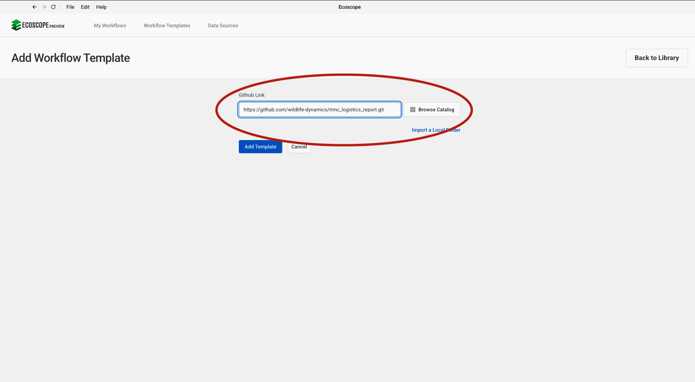
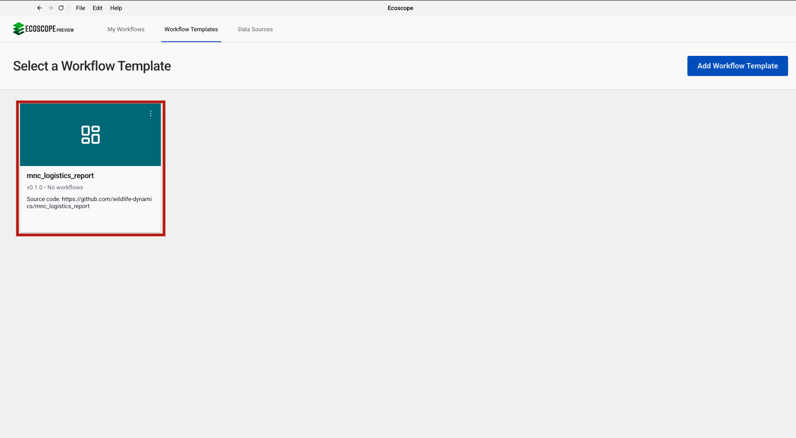

# MNC Logistics Report — User Guide

This guide walks you through configuring and running the MNC Logistics Report workflow, which processes balloon landing, airstrip operations, airstrip maintenance, and airline complaint events from EarthRanger to produce tabular CSV reports.

---

## Overview

The workflow delivers, for each run:

- **balloon_landing_summary_table.csv** — passenger records grouped by balloon company and lodge
- **airstrip_operations_summary_table.csv** — total client counts per camp/lodge pivoted by arrival and departure direction
- **airstrip_maintenance_summary_table.csv** — dated log of airstrip maintenance activities

---

## Prerequisites

Before running the workflow, ensure you have:

- Access to an **EarthRanger** instance with `balloon_landing`, `airstrip_operations`, `airstrip_maintenance`, and `airline_complaint` events recorded for the analysis period

---

## Step-by-Step Configuration

### Step 1 — Add the Workflow Template

In the workflow runner, go to **Workflow Templates** and click **Add Workflow Template**. Paste the GitHub repository URL into the **Github Link** field:

```
https://github.com/wildlife-dynamics/mnc_logistics_report.git
```

Then click **Add Template**.



---

### Step 2 — Configure the EarthRanger Connection

Navigate to **Data Sources** and click **Connect**, then select **EarthRanger**. Fill in the connection form:

| Field | Description |
|-------|-------------|
| Data Source Name | A label to identify this connection (e.g. `Mara North Conservancy`) |
| EarthRanger URL | Your instance URL (e.g. `your-site.pamdas.org`) |
| EarthRanger Username | Your EarthRanger username |
| EarthRanger Password | Your EarthRanger password |

> Credentials are not validated at setup time. Any authentication errors will appear when the workflow runs.

Click **Connect** to save.


---

### Step 3 — Select the Workflow

After the template is added, it appears in the **Workflow Templates** list as **mnc_logistics_report**. Click the card to open the workflow configuration form.



---

### Step 4 — Configure Workflow Details, Time Range, and EarthRanger Connection

The configuration form has three sections on a single page.

**Set workflow details**

| Field | Description |
|-------|-------------|
| Workflow Name | A short name to identify this run |
| Workflow Description | Optional notes (e.g. reporting month or site) |

**Time range**

| Field | Description |
|-------|-------------|
| Timezone | Select the local timezone (e.g. `Africa/Nairobi UTC+03:00`) |
| Since | Start date and time — all logistics events from this point are fetched |
| Until | End date and time of the analysis window |

**Connect to ER**

Select the EarthRanger data source configured in Step 2 from the **Data Source** dropdown (e.g. `Mara North Conservancy`).

Once all three sections are filled, click **Submit**.


---

## Running the Workflow

Once submitted, the runner will:

1. Fetch `balloon_landing`, `airstrip_operations`, `airstrip_maintenance`, and `airline_complaint` events for the analysis period from EarthRanger; extract the date from each event's timestamp; add a temporal index.
2. Filter `balloon_landing` events; process and flatten event details (mapping field IDs to display titles); drop the `event_details__` prefix; retain and rename relevant columns (`balloon_company`, `where_are_clients_staying`, `no_of_passengers`); clean bracket characters; save as `balloon_landing_summary_table.csv`.
3. Filter `airstrip_operations` events; process and flatten event details; drop the `event_details__` prefix; rename columns (`airline`, `arrival_departure`, `attendant`, `camp_lodge`, `no_of_clients`); clean bracket characters; fill missing camp/lodge values; convert client counts to integer; capitalize camp/lodge text; compute totals per camp/lodge by direction; pivot by arrival/departure; save as `airstrip_operations_summary_table.csv`.
4. Filter `airstrip_maintenance` events; process and flatten event details; drop the `event_details__` prefix; retain date and maintenance type columns; save as `airstrip_maintenance_summary_table.csv`.
5. Filter `airline_complaint` events; process and flatten event details; drop the `event_details__` prefix.
6. Save all outputs to the directory specified by `ECOSCOPE_WORKFLOWS_RESULTS`.

---

## Output Files

All outputs are written to `$ECOSCOPE_WORKFLOWS_RESULTS/`.

| File | Description |
|------|-------------|
| `balloon_landing_summary_table.csv` | Passenger records by balloon company and lodge |
| `airstrip_operations_summary_table.csv` | Total clients per camp/lodge pivoted by arrival and departure |
| `airstrip_maintenance_summary_table.csv` | Dated log of airstrip maintenance activity types |
