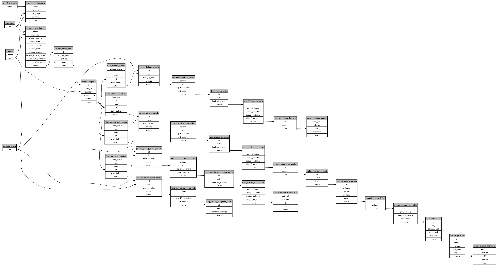

```
# AUTOGENERATED BY ECOSCOPE-WORKFLOWS; see fingerprint in README.md for details

```

```yaml
# fingerprint:
artifacts_sha256_basic: a57e9894c4e80e4299582ca4501e8516a1a75933e90742bfdcc5cf488ea7189a
artifacts_sha256_strict: 110d8865c295053778a248aeaba824c359ba509fc8d4b7070ee3da1675d3ec22
installed_requirements:
- channel: https://repo.prefix.dev/ecoscope-workflows/
  name: ecoscope-workflows-core
  version: {version: ==0.22.18}
- channel: https://repo.prefix.dev/ecoscope-workflows/
  name: ecoscope-workflows-ext-ecoscope
  version: {version: ==0.22.18}
- channel: https://repo.prefix.dev/ecoscope-workflows-custom/
  name: ecoscope-workflows-ext-custom
  version: {version: ==0.0.39}
- channel: https://repo.prefix.dev/ecoscope-workflows-custom/
  name: ecoscope-workflows-ext-ste
  version: {version: ==0.0.13}
- channel: https://repo.prefix.dev/ecoscope-workflows-custom/
  name: ecoscope-workflows-ext-mnc
  version: {version: ==0.0.8}
params_sha256: 3ab4c0f59c459fe3feea277da14ef6a8b3d0dfc0f958f3f015ddd4d700bcc5f8
spec_sha256: 510a00fb0f3ddae6254dbd2e8586eb9dc87962c04f763bb785934bf67de628f8

```

# ecoscope-workflows-mnc-logistics-report-workflow


