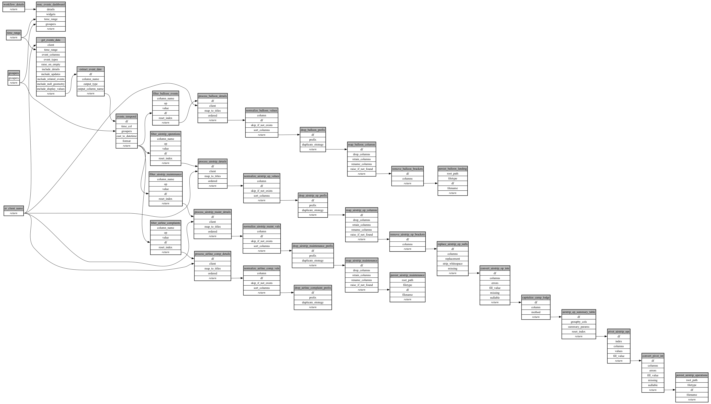

```
# AUTOGENERATED BY ECOSCOPE-WORKFLOWS; see fingerprint in README.md for details

```

```yaml
# fingerprint:
artifacts_sha256_basic: 068323a92ca8ce7ab214edbb89b605e033cf2e5998329ae08d0fc38eb4a1261e
artifacts_sha256_strict: 199f5fa449ca4af29f2e8fe3370cc8c8ef7dfae1eae649f4db749a3707d90ff7
installed_requirements:
- channel: https://repo.prefix.dev/ecoscope-workflows/
  name: ecoscope-workflows-core
  version: {version: ==0.22.18}
- channel: https://repo.prefix.dev/ecoscope-workflows/
  name: ecoscope-workflows-ext-ecoscope
  version: {version: ==0.22.18}
- channel: https://repo.prefix.dev/ecoscope-workflows-custom/
  name: ecoscope-workflows-ext-custom
  version: {version: ==0.0.49}
- channel: https://repo.prefix.dev/ecoscope-workflows-custom/
  name: ecoscope-workflows-ext-ste
  version: {version: ==0.0.20}
- channel: https://repo.prefix.dev/ecoscope-workflows-custom/
  name: ecoscope-workflows-ext-mep
  version: {version: ==0.0.19}
- channel: https://repo.prefix.dev/ecoscope-workflows-custom/
  name: ecoscope-workflows-ext-big-life
  version: {version: ==0.0.11}
- channel: https://repo.prefix.dev/ecoscope-workflows-custom/
  name: ecoscope-workflows-ext-mnc
  version: {version: ==0.0.10}
params_sha256: 3ab4c0f59c459fe3feea277da14ef6a8b3d0dfc0f958f3f015ddd4d700bcc5f8
spec_sha256: 781bbd14ccc1fe9f6679250923cab9268c8787fde1a3bc5a8879a4cf9e2a7451

```

# ecoscope-workflows-mnc-logistics-report-workflow


